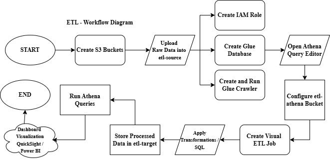
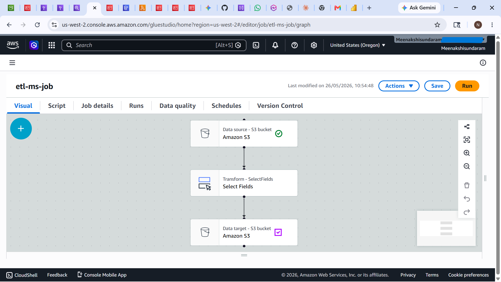

# Serverless-Data-Pipeline-on-AWS


> A production-grade serverless data platform on AWS that ingests real-time customer records,       processes them through an automated ETL pipeline, performs ML-powered sentiment analysis using Amazon Comprehend, and delivers analytics through interactive QuickSight dashboards — built to mirror how enterprise-scale data teams operate on AWS.

## What Is This

> This is a fully serverless, event-driven customer data analytics platform built entirely on AWS managed services. It eliminates the need for any server management while delivering scalable, resilient, and cost-efficient data processing at scale.

- **Ingests** real-time customer records through a REST API layer built with Flask and API Gateway
- **Stores** structured records in DynamoDB with concurrent Lambda triggers for immediate processing
- **Analyzes** customer sentiment in real time using Amazon Comprehend NLP — enabling ML-powered segmentation
- **Transforms** raw data into structured datasets using AWS Glue ETL workflows
- **Queries** processed data using Amazon Athena with standard SQL — no infrastructure needed
- **Visualizes** insights through QuickSight dashboards — reducing report generation from hours to under 5 minutes

## Architecture

<div align="center">
  
  <br>
  <em>Serverless Data Pipeline — AWS Architecture</em>
</div>

## Screenshots

### Data Flow
<div align="center">
  
  <br>
  <em>Data Flow</em>
</div>

### ETL Job
<div align="center">
  
  <br>
  <em>AWS Glue ETL Job Execution</em>
</div>

### ETL Result
<div align="center">
  
  <br>
  <em>ETL Job Output Result</em>
</div>

### Athena Query
<div align="center">
  
  <br>
  <em>Amazon Athena SQL Query on Processed Data</em>
</div>

### S3 Data Lake
<div align="center">
  
  <br>
  <em>S3 Data Lake — Raw and Processed Partitions</em>
</div>

## Core Features

| Feature | What It Does | Tech Used |
|---|---|---|
| REST Ingestion Layer | Accepts real-time customer records via HTTP POST | Flask, API Gateway, Lambda |
| Serverless Processing | Concurrent Lambda triggers handle records without servers | AWS Lambda, DynamoDB |
| ML Sentiment Analysis | Classifies customer sentiment as Positive / Negative / Neutral | Amazon Comprehend, Lambda |
| ETL Pipeline | Crawls S3 data, applies transformations, outputs structured datasets | AWS Glue, Python |
| SQL Analytics | Query processed data using standard SQL — no infrastructure | Amazon Athena |
| BI Dashboards | Visual reports — segment by sentiment, region, time | Amazon QuickSight |

# Tech Stack

| Category | Technology |
|---|---|
| Cloud | AWS (Lambda, API Gateway, DynamoDB, S3, Glue, Athena, QuickSight, Comprehend, EC2, IAM, CloudWatch) |
| Backend | Python 3.12, Flask 3.0+, Gunicorn, Nginx |
| Ingestion | REST API, API Gateway, concurrent Lambda triggers |
| ML / NLP | Amazon Comprehend (sentiment analysis, entity recognition) |
| ETL | AWS Glue (crawler + job scripts), Python Shell jobs |
| Analytics | Amazon Athena, SQL |
| Visualisation | Amazon QuickSight |
| Storage | DynamoDB (hot store), S3 (data lake) |
| Security | IAM least-privilege roles, S3 bucket policies |
| Deployment | EC2 (Flask host), Lambda (serverless compute) |

# How to Run

- 1 Clone Repository

git clone <YOUR_GITHUB_URL>

cd aws-serverless-etl-platform

- 2 Create Virtual Environment

python3 -m venv venv

- 3 Activate Environment

source venv/bin/activate

- 4 Install Dependencies

pip install -r flask-app/requirements.txt

- 5 Update API Gateway URL

nano flask-app/app.py

- Replace:
- API_URL=YOUR_API_URL

- 6 Run Flask Application

cd flask-app
python3 app.py

- Application Runs At

http://EC2_PUBLIC_IP:5000

## API Endpoints

| Method | Path | What It Does |
|---|---|---|
| POST | `/ingest` | Submit a customer record — triggers Lambda + DynamoDB write |
| GET | `/records` | Retrieve all ingested records from DynamoDB |
| GET | `/sentiment/{customer_id}` | Fetch Comprehend sentiment result for a record |
| GET | `/health` | API health check |

> Full interactive API docs available via API Gateway stage URL after deployment.

## ML Pipeline — Amazon Comprehend

**How sentiment analysis works in this pipeline:**

1. Customer record arrives via REST POST → stored in DynamoDB
2. A second Lambda (`comprehend_handler.py`) is triggered concurrently
3. Lambda extracts the customer message field and calls `comprehend.detect_sentiment()`
4. Comprehend returns: `POSITIVE` / `NEGATIVE` / `NEUTRAL` / `MIXED` with confidence scores
5. Sentiment result is written back to the DynamoDB record
6. QuickSight dashboards segment customers by sentiment in real time

## ETL Pipeline — AWS Glue + Athena

```
DynamoDB (raw records)
      │
      ▼ Lambda export_handler.py
S3 (raw JSON — partitioned by date)
      │
      ▼ AWS Glue Crawler
Glue Data Catalog (schema inference)
      │
      ▼ AWS Glue ETL Job (etl_job.py)
S3 (transformed Parquet — partitioned by region + sentiment)
      │
      ▼ Amazon Athena
SQL queries on structured data
      │
      ▼ Amazon QuickSight
Interactive dashboards + sentiment reports
```

## Monitoring

- **CloudWatch Logs** — Lambda execution logs, error tracking, invocation counts
- **CloudWatch Alarms** — alerts on Lambda error rate and DynamoDB throttling
- **API Gateway Metrics** — request count, latency, 4xx/5xx error rates

## What I Learned Building This

- Lambda cold start behaviour — why provisioned concurrency matters for latency-sensitive APIs
- DynamoDB partition key design — how poor key choice causes hot partitions under load
- AWS Glue crawler behaviour with nested JSON — why flattening before crawling produces cleaner schemas
- Athena query cost optimisation — partitioning S3 data by date reduces scan size and cost significantly
- Amazon Comprehend rate limits — batching records reduces API calls and avoids throttling
- IAM least-privilege in practice — scoping Lambda roles to exact DynamoDB table ARNs vs wildcard

## Future Enhancements

- Add EventBridge scheduled rules for automated ETL job triggers
- Implement Step Functions for orchestrating multi-stage Lambda workflows
- Enable DynamoDB Streams for real-time change data capture to S3
- Add SageMaker endpoint for custom ML model inference alongside Comprehend
- Implement CI/CD pipeline using GitHub Actions for Lambda deployments
- Add AWS WAF to API Gateway for production security hardening

## Author

**Meenakshi Sundaram N** 
<br>
**B.Tech Information Technology**
- LinkedIn: [[Click](https://www.linkedin.com/in/meenakshisundaram15/)]
