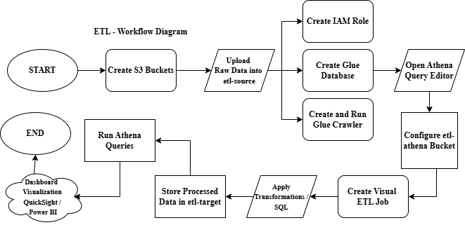
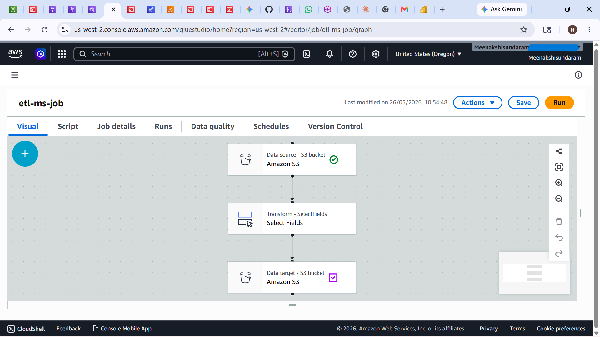

# Serverless-Data-Pipeline-on-AWS


## Project Status: Active Development

**Note: The project is actively being enhanced. Features and implementation details may evolve as development continues.**

> A production-grade serverless data platform on AWS that ingests real-time customer records,       processes them through an automated ETL pipeline, performs ML-powered sentiment analysis using Amazon Comprehend, and delivers analytics through interactive QuickSight dashboards — built to mirror how enterprise-scale data teams operate on AWS.

## What Is This

> This is a fully serverless, event-driven customer data analytics platform built entirely on AWS managed services. It eliminates the need for any server management while delivering scalable, resilient, and cost-efficient data processing at scale.

- **Ingests** real-time customer records through a REST API layer built with Flask and API Gateway
- **Stores** structured records in DynamoDB with concurrent Lambda triggers for immediate processing
- **Analyzes** customer sentiment in real time using Amazon Comprehend NLP — enabling ML-powered segmentation
- **Transforms** raw data into structured datasets using AWS Glue ETL workflows
- **Queries** processed data using Amazon Athena with standard SQL — no infrastructure needed
- **Visualizes** insights through QuickSight dashboards — reducing report generation from hours to under 5 minutes

## Architecture

<div align="center">
  
  <br>
  <em>Serverless Data Pipeline — AWS Architecture</em>
</div>

**Reconciliation Data Flow (new)**

```
Flask (EC2) → API Gateway → ingestion_handler
                                   │
                    ┌──────────────┼──────────────┐
                    ▼                              ▼
            DynamoDB: CustomerRecords      DynamoDB: IngestionLog
                    │
                    ▼ (DynamoDB Streams)
            comprehend_handler (sentiment analysis)
                    │
                    ▼
            DynamoDB: ProcessingLog
                    │
     ┌──────────────┴───────────────┐
     ▼                               ▼
export_handler                reconciliation_handler
     │                               │
     ▼                               ▼
S3: raw-records/              S3: reconciliation-reports/
     │                               │
     ▼                               ▼
Glue Crawler + ETL Job         Glue Crawler
     │                               │
     ▼                               ▼
Amazon Athena  ◄──────────────────────
     │
     ▼
Amazon QuickSight
```

## Screenshots

### Data Flow
<div align="center">
  
  <br>
  <em>Data Flow</em>
</div>

### ETL Job
<div align="center">
  
  <br>
  <em>AWS Glue ETL Job Execution</em>
</div>

### ETL Result
<div align="center">
  
  <br>
  <em>ETL Job Output Result</em>
</div>

### Athena Query
<div align="center">
  
  <br>
  <em>Amazon Athena SQL Query on Processed Data</em>
</div>

### S3 Data Lake
<div align="center">
  
  <br>
  <em>S3 Data Lake — Raw and Processed Partitions</em>
</div>

## Core Features

| Feature | What It Does | Tech Used |
|---|---|---|
| REST Ingestion Layer | Accepts real-time customer records via HTTP POST | Flask, API Gateway, Lambda |
| Serverless Processing | Concurrent Lambda triggers handle records without servers | AWS Lambda, DynamoDB |
| ML Sentiment Analysis | Classifies customer sentiment as Positive / Negative / Neutral | VADER Sentiment (Python), DynamoDB Streams, Lambda |
| Reconciliation Reporting | Compares daily ingested vs. processed record totals, flags discrepancies | Lambda, EventBridge, DynamoDB, S3 |
| ETL Pipeline | Crawls S3 data, applies transformations, outputs structured datasets | AWS Glue, Python |
| SQL Analytics | Query processed data using standard SQL — no infrastructure | Amazon Athena |
| BI Dashboards | Visual reports — segment by sentiment, region, time, and reconciliation match rate | Amazon QuickSight |

# Tech Stack

| Category | Technology |
|---|---|
| Cloud | AWS (Lambda, API Gateway, DynamoDB, DynamoDB Streams, S3, Glue, Athena, QuickSight, EventBridge, EC2, IAM, CloudWatch) |
| Backend | Python 3.12, Flask 3.0+ |
| Ingestion | REST API, API Gateway, concurrent Lambda triggers |
| ML / NLP | VADER Sentiment Analysis (rule-based, lexicon-driven) |
| Reconciliation | Lambda, EventBridge scheduled rules, DynamoDB scans |
| ETL | AWS Glue (crawler + job scripts), PySpark |
| Analytics | Amazon Athena, SQL |
| Visualisation | Amazon QuickSight |
| Storage | DynamoDB (hot store), S3 (data lake) |
| Security | IAM least-privilege roles, S3 bucket policies |
| Deployment | EC2 (Flask host), Lambda (serverless compute) |

# How to Run

**1. Clone Repository**
```bash
git clone
cd Serverless-Data-Pipeline-on-AWS
```
 
**2. Create Virtual Environment**
```bash
python3 -m venv venv
```
 
**3. Activate Environment**
```bash
source venv/bin/activate
```
 
**4. Install Dependencies**
```bash
pip install -r flask-app/requirements.txt
```
 
**5. Update API Gateway URL**
```bash
nano flask-app/app.py
```
Replace:
```python
API_URL = "YOUR_API_URL"
```
 
**6. Run Flask Application**
```bash
cd flask-app
python3 app.py
```
 
**Application Runs At:** `http://EC2_PUBLIC_IP:5000`

## API Endpoints

| Method | Path | What It Does |
|---|---|---|
| POST | `/ingest` | Submit a customer record — triggers Lambda + DynamoDB write |
| GET | `/records` | Retrieve all ingested records from DynamoDB |
| GET | `/sentiment/{customer_id}` | Fetch Comprehend sentiment result for a record |
| GET | `/health` | API health check |

| Method | Path | What It Does |
|---|---|---|
| POST | `/submit` | Submit customer records via web form — triggers ingestion Lambda + DynamoDB write |
| GET | `/health` | API health check |

> Full interactive API docs available via API Gateway stage URL after deployment.

## Sentiment Analysis Pipeline
 
**How sentiment analysis works in this pipeline:**
 
1. Customer record arrives via REST POST → stored in DynamoDB with `status: ingested`
2. DynamoDB Streams triggers `comprehend_handler.py` automatically on every new record
3. Lambda extracts the record's text and scores it using VADER's `SentimentIntensityAnalyzer`
4. Compound score is bucketed into: `POSITIVE` / `NEGATIVE` / `NEUTRAL`
5. Sentiment result is written back to the DynamoDB record, and status updates to `processed`
6. Processed/failed counts are logged to `ProcessingLog` for reconciliation
7. QuickSight dashboards segment customers by sentiment in real time
> **Design note:** This pipeline was originally built against Amazon Comprehend. During development, the AWS account in use returned a `SubscriptionRequiredException` on Comprehend calls — an account-level service restriction unrelated to IAM permissions. Rather than block the pipeline on that, sentiment scoring was swapped to `vaderSentiment`, a lightweight, rule-based sentiment engine that runs entirely inside the Lambda with no external API dependency. The event-driven architecture (DynamoDB Streams → Lambda → status update) is unchanged, and the code is written so the analyzer can be swapped back to Comprehend or another NLP service with a single function change.

## Reconciliation & Book-Closure Reporting
 
> Automated daily reconciliation compares ingested vs. processed record counts and flags discrepancies, mirroring how a financial book-closure >   process reconciles ledgers at period end.
 
**How it works:**
1. `ingestion_handler.py` logs every incoming batch's record count to `IngestionLog`
2. `comprehend_handler.py` logs processed/failed counts to `ProcessingLog` after sentiment scoring
3. `reconciliation_handler.py` runs daily on an EventBridge schedule (`cron(0 0 * * ? *)`), sums the day's `IngestionLog` and `ProcessingLog` totals, and computes:
   - Total ingested vs. total processed
   - Discrepancy count
   - Match rate percentage
4. The report is written as JSON to `s3://.../reconciliation-reports/YYYY-MM-DD.json`
5. `export_handler.py` separately exports processed records hourly to `s3://.../raw-records/` in JSON Lines format for downstream Glue/Athena querying

## ML Pipeline — Amazon Comprehend

**How sentiment analysis works in this pipeline:**

1. Customer record arrives via REST POST → stored in DynamoDB
2. A second Lambda (`comprehend_handler.py`) is triggered concurrently
3. Lambda extracts the customer message field and calls `comprehend.detect_sentiment()`
4. Comprehend returns: `POSITIVE` / `NEGATIVE` / `NEUTRAL` / `MIXED` with confidence scores
5. Sentiment result is written back to the DynamoDB record
6. QuickSight dashboards segment customers by sentiment in real time

## ETL Pipeline — AWS Glue + Athena

```
DynamoDB (raw records)
      │
      ▼ Lambda export_handler.py
S3 (raw JSON Lines — partitioned by date)
      │
      ▼ AWS Glue Crawler
Glue Data Catalog (schema inference)
      │
      ▼ AWS Glue ETL Job (etl_job.py)
S3 (transformed Parquet — partitioned by sentiment)
      │
      ▼ Amazon Athena
SQL queries on structured data
      │
      ▼ Amazon QuickSight
Interactive dashboards + sentiment + reconciliation reports
```

## Monitoring

- **CloudWatch Logs** — Lambda execution logs, error tracking, invocation counts
- **CloudWatch Alarms** — alerts on Lambda error rate and DynamoDB throttling
- **API Gateway Metrics** — request count, latency, 4xx/5xx error rates
- **Reconciliation reports** — daily match-rate tracking as a functional data-quality monitor

## What I Learned Building This

- Lambda cold start behaviour — why provisioned concurrency matters for latency-sensitive APIs
- DynamoDB partition key design — how poor key choice causes hot partitions under load
- DynamoDB Streams as an event source — using `NewImage` payloads to drive downstream processing without polling
- AWS Glue crawler behaviour with JSON — why JSON Lines (one object per line) is required for reliable schema inference, versus a single JSON array which Spark's reader cannot always infer
- Designing for vendor/service restrictions — building an abstraction (sentiment scoring function) that let the pipeline keep working when a managed AWS service (Comprehend) was unexpectedly unavailable at the account level
- Athena query cost optimisation — partitioning S3 data by date/sentiment reduces scan size and cost significantly
- IAM least-privilege in practice — scoping Lambda roles to exact DynamoDB table ARNs vs wildcard, and configuring trust policies for multiple AWS services (Lambda + Glue) to assume the same role.


## Current Status
 
- ✅ Ingestion, sentiment processing, export, and daily reconciliation — fully working end-to-end
- ✅ Flask front-end on EC2, API Gateway, DynamoDB Streams event pipeline
-    Glue ETL job (raw JSON → partitioned Parquet) — script written, schema inference debugging in progress
-    Athena queries and QuickSight dashboards — pending Glue ETL completion

## Future Enhancements

- Complete Glue ETL job debugging and Athena/QuickSight integration for reconciliation reports
- Implement Step Functions for orchestrating multi-stage Lambda workflows
- Add a cluster/workload migration automation module with pre/post health validation
- Auto-file tracking tickets (GitHub Issues API) on detected pipeline failures for proactive incident response
- Implement CI/CD pipeline using GitHub Actions for Lambda deployments
- Add AWS WAF to API Gateway for production security hardening

## Author

**Meenakshi Sundaram N** 
<br>
**B.Tech Information Technology**
- LinkedIn: [[Click](https://www.linkedin.com/in/meenakshisundaram15/)]
